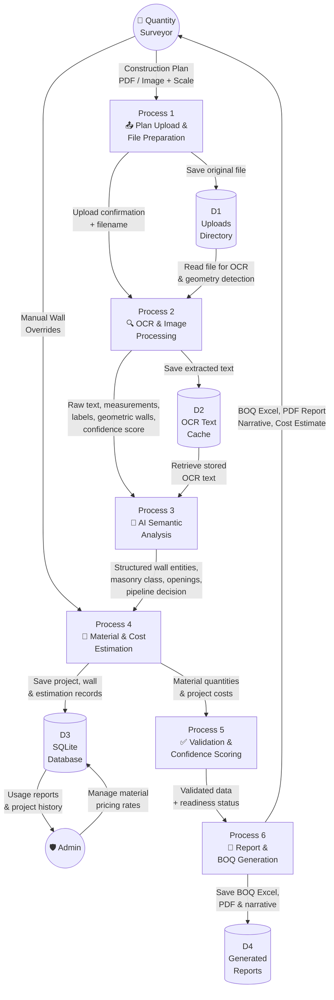
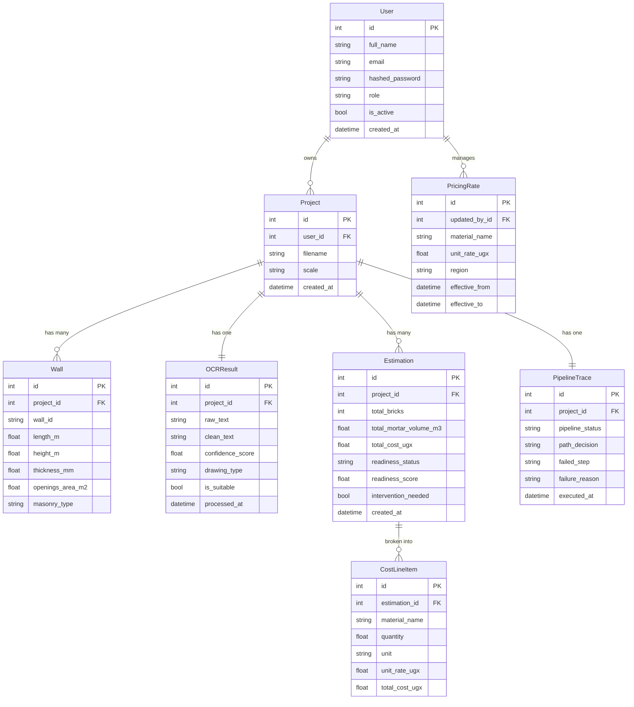

# AI Automated Material & Cost Estimation — System Diagrams

---

## 1. DATA FLOW DIAGRAM (Level 1)

```mermaid
flowchart TD

    %% ─── External Entities ───
    USER((👤 Quantity\nSurveyor))
    ADMIN((🛡️ Admin))

    %% ─── Processes ───
    P1["Process 1\n📤 Plan Upload &\nFile Preparation"]
    P2["Process 2\n🔍 OCR & Image\nProcessing"]
    P3["Process 3\n🧠 AI Semantic\nAnalysis"]
    P4["Process 4\n📐 Material & Cost\nEstimation"]
    P5["Process 5\n✅ Validation &\nConfidence Scoring"]
    P6["Process 6\n📄 Report &\nBOQ Generation"]

    %% ─── Data Stores ───
    DS1[(D1\nUploads\nDirectory)]
    DS2[(D2\nOCR Text\nCache)]
    DS3[(D3\nSQLite\nDatabase)]
    DS4[(D4\nGenerated\nReports)]

    %% ─── User Inputs ───
    USER -->|"Construction Plan\nPDF / Image + Scale"| P1
    USER -->|"Manual Wall\nOverrides"| P4

    %% ─── P1 Flows ───
    P1 -->|"Save original file"| DS1
    P1 -->|"Upload confirmation\n+ filename"| P2

    %% ─── P2 Flows ───
    DS1 -->|"Read file for OCR\n& geometry detection"| P2
    P2 -->|"Save extracted text"| DS2
    P2 -->|"Raw text, measurements,\nlabels, geometric walls,\nconfidence score"| P3

    %% ─── P3 Flows ───
    DS2 -->|"Retrieve stored\nOCR text"| P3
    P3 -->|"Structured wall entities,\nmasonry class, openings,\npipeline decision"| P4

    %% ─── P4 Flows ───
    P4 -->|"Save project, wall\n& estimation records"| DS3
    P4 -->|"Material quantities\n& project costs"| P5

    %% ─── P5 Flows ───
    P5 -->|"Validated data\n+ readiness status"| P6

    %% ─── P6 Flows ───
    P6 -->|"Save BOQ Excel,\nPDF & narrative"| DS4
    P6 -->|"BOQ Excel, PDF Report\nNarrative, Cost Estimate"| USER

    %% ─── Admin ───
    ADMIN -->|"Manage material\npricing rates"| DS3
    DS3 -->|"Usage reports\n& project history"| ADMIN
```

---

## 2. FLOWCHART — Full Pipeline Execution

```mermaid
flowchart TD

    START([START\nUser Clicks Run Full Estimation])

    A1{File\nSelected?}
    A_ERR([Error: No file selected])

    B1["Upload Plan\nPOST /upload/plan\nSave to uploads/"]
    B2{File Format\nValid?\nPDF / PNG / JPG}
    B_ERR([Error: Unsupported file format])

    C1["Create Project Record in DB\nProject table INSERT\nfilename, scale, created_at"]

    D1{Is file\na PDF?}
    D_A["Convert PDF → Images\npdf2image library\nSave pages to outputs/pdf_images/"]
    D_B["Use image directly\nfrom uploads/"]
    D2{Images\nExtracted?}
    D_ERR([Pipeline FAILED:\nCannot process file])

    E1["Preprocess Image\nBinarize & Deskew\nimage_preprocessing.py"]
    E2["Run OCR on Image\npytesseract + PIL\nocr_service.py"]
    E3["Post-Process OCR Text\nClean noise, extract measurements & labels\nocr_postprocess.py"]
    E4["Save OCR text to\noutputs/ocr_text/"]

    F1["Classify Drawing\nclassification_service.py\nDetect: floor plan / section / elevation"]
    F2{Drawing\nSuitable?}
    F_WARN["Add Warning:\nLow Suitability\nContinue with caution"]

    G1["Semantic Interpretation\nai_interpreter.py\nsemantic_interpreter.py\nExtract wall IDs & lengths"]
    G2["Extract Wall Geometry\nOpenCV line detection\ngeometry_service.py"]
    G3["Detect Openings\nDoors & Windows\nopening_service.py"]
    G4["Normalize Wall Thickness\n100mm / 200mm / 300mm\nnormalization_service.py"]
    G5["Classify Masonry\nBRICK or BLOCK per wall\nmasonry_service.py"]

    H1{Walls\nDetected?}
    H_WARN["Set intervention_needed = True\nAlert user — no walls found"]

    I1["Assess Pipeline Path\npipeline_decision_service.py"]
    I2{Confidence\nScore}
    I_A["Path: FULL AUTO\nProceed automatically"]
    I_B["Path: SEMI AUTO\nPre-fill UI, request user review"]
    I_C([Path: MANUAL REQUIRED\nBlock — alert user to input manually])

    J1["Calculate Wall Quantities\nArea m² & Volume m³ per wall\nwall_quantity_calculator.py"]

    K1{Manual Wall\nOverrides\nProvided?}
    K_A["Fuse OCR + Manual Data\nManual takes precedence\nfusion_service.py"]
    K_B["Use AI-extracted\nwalls only"]

    L1["Estimate Materials\nbricks needed = 60/m²\nmortar = 0.23 m³/1000 bricks\nwall_material_service.py"]

    M1["Calculate Project Costs\nApply UGX market rates\nDecompose mortar → cement bags + sand\ncost_service.py"]

    N1["Persist to Database\nWall records INSERT\nEstimation record INSERT\ncrud.py"]
    N2{DB Save\nSuccessful?}
    N_W["Log Warning\nNon-fatal — continue"]

    O1["Analyze Confidence\n0.0 → 1.0 score\nconfidence_service.py"]
    O2["Assess Project Readiness\nreadiness_service.py"]
    O3{Readiness\nStatus}
    O_HI["HIGH ✅\nAuto-approve for export"]
    O_ME["MEDIUM 🟡\nShow warnings, allow override"]
    O_LO["LOW 🔴\nFlag for human review\nintervention_needed = True"]

    P1R["Analyze Pipeline Failures\nfailure_analysis_service.py\nCategorize any failed steps"]
    Q1["Log Engineering Assumptions\nassumptions_service.py\nRecord all default values used"]

    R1["Generate Narrative Report\nnarrative_service.py\nProfessional Engineer's Summary"]
    R2["Export BOQ to Excel\nexport_service.py / openpyxl"]
    R3["Export BOQ to PDF\nreport_service.py / reportlab"]

    S1["Attach Evidence Attribution\nLink values to OCR source text\nattribution_service.py"]
    T1["Generate Pipeline Trace\nFull audit trail\ntrace_report_service.py"]

    V1["Assemble Final Result\nStatus: SUCCESS\nwall_count, total_cost\nreadiness_score, download links\nnarrative_report"]

    FAIL(["Pipeline FAILED\nReturn error status\n+ reason to frontend"])
    END([END: Deliver Results to User])

    START --> A1
    A1 -- No --> A_ERR
    A1 -- Yes --> B1 --> B2
    B2 -- No --> B_ERR
    B2 -- Yes --> C1 --> D1
    D1 -- Yes PDF --> D_A --> D2
    D1 -- No Image --> D_B --> E1
    D2 -- No --> D_ERR
    D2 -- Yes --> E1
    E1 --> E2 --> E3 --> E4 --> F1
    F1 --> F2
    F2 -- No --> F_WARN --> G1
    F2 -- Yes --> G1
    G1 --> G2 --> G3 --> G4 --> G5 --> H1
    H1 -- No Walls --> H_WARN --> I1
    H1 -- Yes --> I1
    I1 --> I2
    I2 -- "> 0.7" --> I_A --> J1
    I2 -- "0.3–0.7" --> I_B --> J1
    I2 -- "< 0.3" --> I_C
    J1 --> K1
    K1 -- Yes --> K_A --> L1
    K1 -- No --> K_B --> L1
    L1 --> M1 --> N1 --> N2
    N2 -- No --> N_W --> O1
    N2 -- Yes --> O1
    O1 --> O2 --> O3
    O3 -- HIGH --> O_HI --> P1R
    O3 -- MEDIUM --> O_ME --> P1R
    O3 -- LOW --> O_LO --> P1R
    P1R --> Q1 --> R1 --> R2 --> R3 --> S1 --> T1 --> V1 --> END
    I_C --> FAIL
```

---

## 3. ENTITY RELATIONSHIP DIAGRAM (ERD)

```mermaid
erDiagram

    User {
        int id PK
        string full_name
        string email
        string hashed_password
        string role
        bool is_active
        datetime created_at
    }

    Project {
        int id PK
        int user_id FK
        string filename
        string scale
        datetime created_at
    }

    Wall {
        int id PK
        int project_id FK
        string wall_id
        float length_m
        float height_m
        float thickness_mm
        float openings_area_m2
        string masonry_type
    }

    OCRResult {
        int id PK
        int project_id FK
        string raw_text
        string clean_text
        float confidence_score
        string drawing_type
        bool is_suitable
        datetime processed_at
    }

    Estimation {
        int id PK
        int project_id FK
        int total_bricks
        float total_mortar_volume_m3
        float total_cost_ugx
        string readiness_status
        float readiness_score
        bool intervention_needed
        datetime created_at
    }

    CostLineItem {
        int id PK
        int estimation_id FK
        string material_name
        float quantity
        string unit
        float unit_rate_ugx
        float total_cost_ugx
    }

    PipelineTrace {
        int id PK
        int project_id FK
        string pipeline_status
        string path_decision
        string failed_step
        string failure_reason
        datetime executed_at
    }

    PricingRate {
        int id PK
        int updated_by_id FK
        string material_name
        float unit_rate_ugx
        string region
        datetime effective_from
        datetime effective_to
    }

    User ||--o{ Project : "owns"
    User ||--o{ PricingRate : "manages"
    Project ||--o{ Wall : "has many"
    Project ||--|| OCRResult : "has one"
    Project ||--o{ Estimation : "has many"
    Project ||--|| PipelineTrace : "has one"
    Estimation ||--o{ CostLineItem : "broken into"
```
