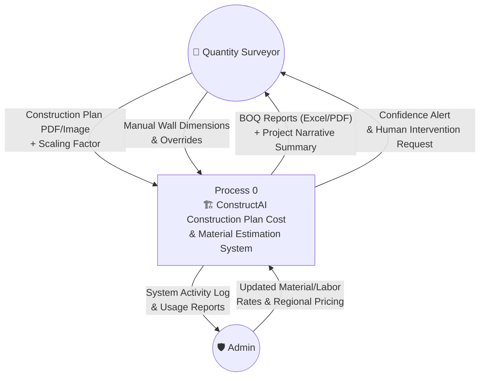
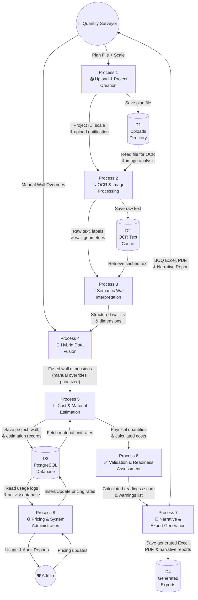
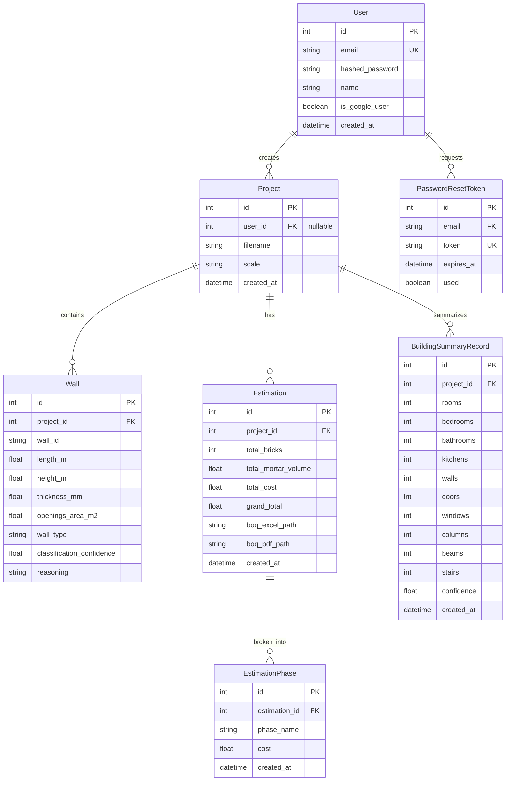

# ConstructAI Construction Plan Cost & Material Estimation — System Diagrams

This document contains the system architecture diagrams for the ConstructAI platform, including the Context Diagram (DFD Level 0), Data Flow Diagram (DFD Level 1), Use Case Diagram, Entity Relationship Diagram (ERD), and Pipeline Flowchart. All diagrams are designed to adhere strictly to formal modeling rules.

---

## 1. DATA FLOW DIAGRAMS (DFD)

### DFD Rules Applied:
* **No External Entity to Data Store**: External entities (e.g., Quantity Surveyor, Admin) must never write directly to or read directly from data stores. All interactions are routed through a Process.
* **No External Entity to External Entity**: External entities do not directly communicate with each other inside the system boundary.
* **No Data Store to Data Store**: Data stores cannot exchange data directly; they must interact through processes.
* **Balanced Inputs/Outputs**: Every process must have at least one input and one output (no "black holes" or "miracles").
* **Naming Conventions**: Processes are labeled with action verbs; external entities and data stores are labeled with nouns.

---

### A. Level 0 DFD (Context Diagram)

The Context Diagram establishes the scope of the system, showing the main system boundary, the external entities that interact with it, and the high-level inputs and outputs.



---

### B. Level 1 DFD (Decomposed System Processes)

The Level 1 DFD decomposes the system into detailed functional processes, identifying the data stores and internal data routes.



---

## 2. USE CASE DIAGRAM

The Use Case Diagram describes the system functionality from the perspective of the primary actors (Quantity Surveyor and Administrator), defining actions executed within the system boundary.

```mermaid
flowchart LR
    %% Actors
    subgraph Actors
        QS["👤 Quantity Surveyor\n(User)"]
        ADMIN["🛡️ System Admin"]
    end

    %% System Boundary
    subgraph System ["System: ConstructAI Construction Estimation Engine"]
        direction TB
        
        %% Use Cases for QS
        UC1(["Upload Plan File\n(PDF / Image)"])
        UC2(["Configure Scale\n& Measurements"])
        UC3(["View Visual AI\nWall Detection"])
        UC4(["Input Manual Wall\nOverrides"])
        UC5(["Execute Cost & Material\nEstimation"])
        UC6(["Review Readiness\n& Confidence Report"])
        UC7(["Export BOQ Reports\n(Excel / PDF)"])
        
        %% Use Cases for Admin
        UC8(["Update Material &\nLabor Pricing Rates"])
        UC9(["Audit System Usage\n& Project Logs"])
    end

    %% Associations
    QS --> UC1
    QS --> UC2
    QS --> UC3
    QS --> UC4
    QS --> UC5
    QS --> UC6
    QS --> UC7

    ADMIN --> UC8
    ADMIN --> UC9
```



---

## 3. ENTITY RELATIONSHIP DIAGRAM (ERD)

This ERD represents the relational database schema implemented in the PostgreSQL database. It identifies fields, keys, data types, and cardinality constraints.



---

## 4. PIPELINE EXECUTION FLOWCHART

### Flowchart Rules Applied:
* **Terminal Symbols**: Oval/Capsule shapes (`([Start / End])`) denote execution entry/exit boundaries.
* **Process Steps**: Rectangles (`["Process Name"]`) represent computational or system operations.
* **Decision Nodes**: Diamonds (`{"Condition?"}`) represent branching tests with explicit label routes.
* **Input / Output Nodes**: Parallelograms (`[/Data I/O/]`) represent data ingestion and file delivery points.

```mermaid
flowchart TD

    START([START\nUser runs estimation pipeline]) --> A1{File & scale\nprovided?}
    
    A1 -- No --> A_ERR([Error: Missing inputs])
    A1 -- Yes --> B1[/Upload Plan PDF/Image\nPOST /upload/plan/]
    
    B1 --> B2{File Format\nSupported?}
    B2 -- No --> B_ERR([Error: Unsupported file format])
    B2 -- Yes --> C1["Create Project Record in DB\n(projects table)"]
    
    C1 --> D1{Is file a PDF?}
    D1 -- Yes --> D_A["Convert PDF to Images\n(pdf2image library)"] --> D2{Success?}
    D1 -- No --> D_B["Use image directly"] --> E1["Preprocess Image\n(Binarize & Deskew)"]
    
    D2 -- No --> D_ERR([Pipeline Failed])
    D2 -- Yes --> E1
    
    E1 --> E2["Run OCR on Image\n(pytesseract)"]
    E2 --> E3["Clean OCR Text & Extract\nLabels / Dimensions"]
    E3 --> E4[/Save raw OCR text\noutputs/ocr_text/cache/]
    
    E4 --> F1["Classify Drawing Type\n(Floor Plan / Section / Elevation)"]
    F1 --> F2{Suitable for\nwall extraction?}
    F2 -- No --> F_WARN["Add Low Suitability Warning"] --> G1["Extract Semantics & Wall IDs\n(ai_interpreter.py)"]
    F2 -- Yes --> G1
    
    G1 --> G2["Detect Geometric Wall Lines\n(OpenCV)"]
    G2 --> G3["Detect Openings\n(Doors & Windows)"]
    G3 --> G4["Normalize Wall Thickness"]
    G4 --> G5["Classify Masonry Type\n(Brick / Block)"]
    
    G5 --> H1{Any walls\ndetected?}
    H1 -- No --> H_WARN["Set intervention_needed = True\nFlag missing data alert"] --> I1["Evaluate Pipeline path\n(confidence_service)"]
    H1 -- Yes --> I1
    
    I1 --> I2{OCR Confidence\nScore?}
    I2 -- "< 0.3" --> I_FAIL([Pipeline Blocked:\nManual Entry Required])
    I2 -- "0.3 - 0.7" --> I_SEMI["Path: SEMI-AUTO\nPre-fill UI, flag review"] --> J1["Calculate physical wall volume\n(area & height calculations)"]
    I2 -- "> 0.7" --> I_AUTO["Path: FULL-AUTO\nProceed automatically"] --> J1
    
    J1 --> K1{Manual Overrides\nprovided by user?}
    K1 -- Yes --> K_A["Fuse AI & Manual Data\n(Manual overrides take priority)"] --> L1["Calculate Material Volume\n(Bricks & Mortar components)"]
    K1 -- No --> K_B["Use AI-extracted wall data"] --> L1
    
    L1 --> M1["Compute costs utilizing\nmaterial rate database"]
    M1 --> N1[/Write results to DB\nestimations & walls tables/]
    
    N1 --> N2{Save\nSuccessful?}
    N2 -- No --> N_WARN["Log Database Warning"] --> O1["Assess overall project readiness\n(readiness_service)"]
    N2 -- Yes --> O1
    
    O1 --> O2{Readiness\nScore Status?}
    O2 -- "LOW" --> O_LO["Flag for strict human review\nintervention_needed = True"] --> P1["Execute pipeline failure analysis\n(classify pipeline errors)"]
    O2 -- "MEDIUM" --> O_ME["Mark ready with warnings\nallow override"] --> P1
    O2 -- "HIGH" --> O_HI["Mark project as ready"] --> P1
    
    P1 --> Q1["Log engineering assumptions\n& defaults utilized"]
    Q1 --> R1["Generate Narrative report\n(engineer summary)"]
    
    R1 --> R2[/Export BOQ to Excel\n(openpyxl)/]
    R2 --> R3[/Export BOQ to PDF\n(reportlab)/]
    
    R3 --> S1["Link evidence attribution\n(data source mapping)"]
    S1 --> T1["Generate pipeline trace audit trail"]
    
    T1 --> V1[/Assemble final JSON response\nDeliver success payload/]
    V1 --> END([END: Render estimation to client])
